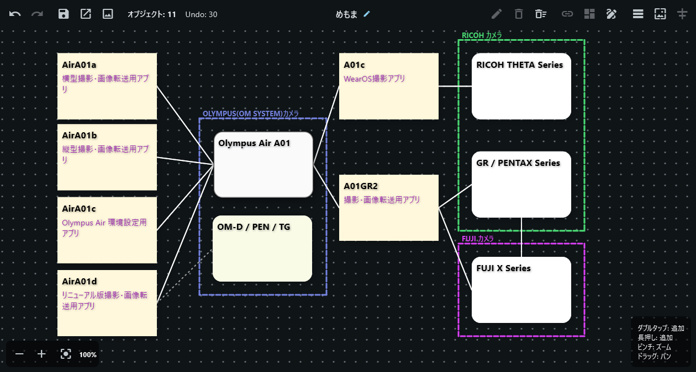
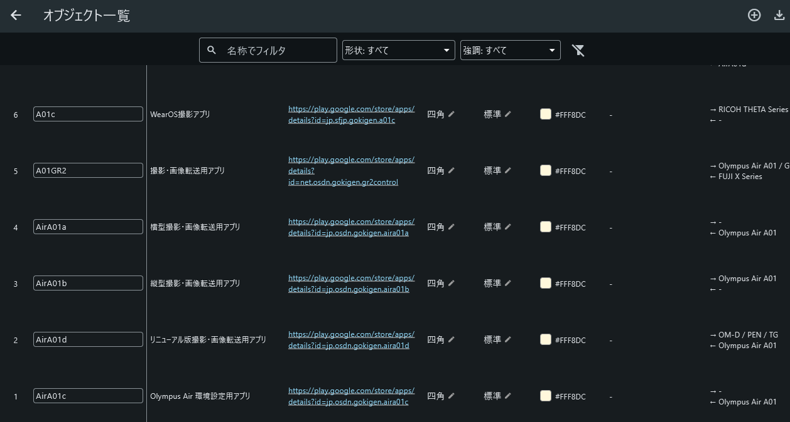

# memoma3

無限キャンバス上にメモ（オブジェクト）を自由に配置・移動でき、接続線やグループで整理しながらアイデアを可視化するアプリです。

- **開発言語**: Flutter (Dart)
- **状態管理**: Riverpod (3.x)
- **対応プラットフォーム**: Windows / Web / Android / Linux
- **ファイル入出力**: `file_picker`（クロスプラットフォーム対応）
- **オブジェクト編集**: 14 形状・強調レベル・ラベル・本文・説明・本体色・ラベル色・説明色の編集に対応
- **カラーピッカー**: `flex_color_picker` を使用した柔軟な色選択に対応
- **接続線**: 2 つのオブジェクトを線でつなぐ（線種 4 種・形状 6 種・色設定・接続解除）
- **グループ化**: 複数のオブジェクトを囲むグループ枠（名称・説明・枠線の色・枠ごと移動）
- **整列**: 1 個選択で X/Y を 10 の倍数に、複数選択で左/右/上/下/等間隔（横幅・縦幅）
- **選択モード**: キーボードのない環境（Android 等）向けの複数選択（タップで選択トグル・全選択）
- **Undo / Redo**: 最大 30 件まで戻す・やり直す
- **画像 / PDF エクスポート**: キャンバスを PNG / PDF に書き出し
- **オブジェクト一覧**: 全オブジェクトの属性を表示・フィルタ・ソートし、CSV エクスポート
- **背景ガイド**: グリッド（罫線/ドット）・背景色・背景画像を設定（再起動後も保持）
- **ドキュメント**: 仕様・設計・操作説明は `docs/` フォルダに収録

## ドキュメント

| ファイル | 内容 |
| --- | --- |
| [`docs/SPECIFICATION.md`](docs/SPECIFICATION.md) | 機能仕様書 |
| [`docs/ARCHITECTURE.md`](docs/ARCHITECTURE.md) | 概略設計書（アーキテクチャ・データ構造） |
| [`docs/DETAILED_DESIGN.md`](docs/DETAILED_DESIGN.md) | 詳細設計書（各クラスの役割） |
| [`docs/MANUAL.md`](docs/MANUAL.md) | ユーザー向け操作説明書 |
| [`docs/JSON.md`](docs/JSON.md) | 保存する JSON ファイルの仕様 |
| [`docs/CSV.md`](docs/CSV.md) | オブジェクト一覧で出力する CSV ファイルの仕様 |
| [`docs/DEVELOPMENT.md`](docs/DEVELOPMENT.md) | ファイル構造・依存パッケージ・ビルド方法 |

---

## スクリーンショット





---

## 機能説明

### 無限キャンバス

`InteractiveViewer`（`TransformationController` 付き）により、
キャンバス全体のパン（ドラッグ）とズーム（ピンチ）が可能です。
キャンバスは `50000 x 50000 px` の広大な `Stack` として構成されています。

### オブジェクト（メモ）の追加

- **ダブルタップ**: タップした位置に新しいオブジェクトを追加します。
- **長押し**: 長押しした位置に新しいオブジェクトを追加します。

追加位置は `TransformationController` の現在の拡大率・移動オフセットを
考慮してキャンバス上の正しい座標に変換された後、オブジェクトが配置されます。

### オブジェクトの操作

- **タップ**: オブジェクトを選択します（再度タップで選択解除）。選択中のオブジェクトは影と枠線で強調されます。
- **Ctrl + タップ**: 選択を追加または解除します（複数選択）。他のオブジェクトの選択状態は維持されます。
- **ドラッグ**: オブジェクトを移動します。ドラッグ中はローカル表示座標が即座に更新され、
  移動量は現在の拡大率で割られるため、ズーム状態に関係なく自然に追従します。
- **最前面移動**: オブジェクトをタップ／ドラッグ開始した際、そのオブジェクトが
  Z-Index のトップ（リスト末尾）へ移動します。
- **編集**: 上部アクションバーの「編集」ボタン、またはオブジェクトのダブルタップ／長押しで、選択中のオブジェクトの形状・ラベル・詳細・説明・色・ラベル色・説明色を変更できます。
- **削除**: 上部アクションバーの「削除」ボタンで選択中のオブジェクトを削除します（複数選択時は全選択分を削除）。

### オブジェクトの選択

#### 選択方法

| 操作 | 結果 |
| --- | --- |
| **通常タップ** | 全選択を解除し、タップしたオブジェクトのみを選択（単一選択） |
| **再タップ（同じオブジェクト）** | 選択を解除 |
| **Ctrl + タップ** | そのオブジェクトの選択をトグル（追加/解除）。他の選択は維持（複数選択） |
| **ドラッグ開始** | 全選択を解除し、ドラッグしたオブジェクトのみを選択（単一選択） |

#### 選択モード（キーボードのない環境向け）

キーボードが接続されていない環境（Android 等）では Ctrl+タップが使えないため、上部アクションバーの「選択モード」ボタンで選択モードを有効にすると、タップのみで複数選択できます。

| 操作 | 結果 |
| --- | --- |
| 「選択モード」ボタン | 選択モードを有効/無効に切替（接続モードと排他） |
| オブジェクトをタップ | そのオブジェクトの選択をトグル（追加/解除）。他の選択は維持 |
| 空き領域をタップ | 全選択を解除 |
| 「全選択」ボタン | 全オブジェクトを選択（選択モード中かつオブジェクトがあるときのみ有効） |
| 「選択モード」ボタン（再度） | 選択モードを終了（選択状態は保持） |

選択モード中は、オブジェクトのドラッグ移動や空き領域のダブルタップ/長押しによる新規作成は行われません（誤操作防止）。

#### 1つのオブジェクトを選択しているときの操作

| 操作 | トリガー | 内容 |
| --- | --- | --- |
| 選択解除 | 同じオブジェクトを再タップ | 選択を解除 |
| 最前面へ移動 | タップ / ドラッグ開始時 | Z順を最前面に変更 |
| 移動 | ドラッグ | オブジェクトの位置を変更 |
| 編集ダイアログ | ダブルタップ / 長押し | 形状・ラベル・詳細・色などを編集 |
| 編集（ツールバー） | 「編集」ボタン | 編集ダイアログを表示 |
| 削除（ツールバー） | 「削除」ボタン | 選択中のオブジェクトを削除 |
| グループ化（ツールバー） | 「グループ化」ボタン | 選択中のオブジェクトをグループ枠で囲む |
| 接続モードで接続 | 接続モード中、オブジェクトからドラッグ | ドラッグ先のオブジェクトと接続線を引く |

#### 複数オブジェクトを選択しているときの操作

| 操作 | トリガー | 内容 |
| --- | --- | --- |
| 選択の追加/解除 | Ctrl + タップ | 選択に追加、または選択から外す |
| 削除（ツールバー） | 「削除」ボタン | 選択中の**全オブジェクト**を削除 |
| 接続（ツールバー） | 「接続」ボタン | 選択中のオブジェクトの**全ペア**に接続線を引く |
| グループ化（ツールバー） | 「グループ化」ボタン | 選択中のオブジェクトをグループ枠で囲む |
| 接続モードで接続 | 接続モード中、オブジェクトからドラッグ | ドラッグ先のオブジェクトと接続線を引く |

#### 複数選択時にできない操作

| 操作 | 理由 |
| --- | --- |
| 編集（ツールバー） | 1つのオブジェクトを編集する前提のため、単一選択にする必要がある |
| 編集ダイアログ（ダブルタップ/長押し） | 1つのオブジェクトを編集する前提 |
| 移動（ドラッグ） | 1つのオブジェクトをドラッグすると単一選択に切り替わる |

### Undo / Redo

ドラッグ終了時（`PanEnd`）にのみ履歴へ状態が保存されます。

- **Undo**: アクションバーの「Undo」ボタンで 1 つ前の状態に戻ります。
- **Redo**: アクションバーの「Redo」ボタンで、Undo した状態をやり直します。
- 履歴は最大 **30 件**保持されます。
- 新しい操作を行うと Redo スタックはクリアされます。

### 自動保存（自動永続化）

- キャンバス上の操作（メモの追加・移動・編集、接続線、グループ、キャンバス名の変更など）は、**自動的に保存**されます。
- 保存先はアプリ内部の領域（`hive_ce` の box `memoma3_canvas`）です。ファイル選択は不要です。
- アプリを終了して再度起動すると、**前回の状態のまま**表示されます。
- 書き込みはデバウンス（400ms）でまとめ、アプリ終了時に未保存データを確実に書き込みます。
- 手動の「保存 / 読み込み」（JSON ファイル）は、ファイルを共有・バックアップしたいときに引き続き利用できます。

### 保存 / 読み込み

- **保存**: 全オブジェクトを JSON 文字列として保存します。
  - Windows / Android: `file_picker` の `saveFile` で保存先を選択。
  - Web: 保存ダイアログのフィールドに JSON 文字列を表示し、コピー／保存します。
- **読み込み**: JSON を読み込んでキャンバス状態を復元します。
  - Windows / Android: `file_picker` の `pickFiles` でファイルを選択。
  - Web: ダイアログのフィールドに JSON 文字列を入力して読み込みます。
- **エラー通知**: 保存・読み込み時にエラーが発生した場合は、ダイアログで「エラーが発生しました」を表示します。

### ズーム制御

メイン画面の左下にズーム制御パネルを配置しています。

- **縮小**: キャンバスを縮小します。
- **拡大**: キャンバスを拡大します。
- **リセット**: ズーム倍率・パンを初期状態（1倍、原点）に戻します。

### オブジェクトの線でつなぐ（接続線）

2つのオブジェクトを線でつなぐ機能です。線には描画形状（`LineShape`）と線種（`LineType`）を設定できます。

#### 接続線の操作方法

- **ドラッグで接続**: 上部アクションバーの「接続モード」ボタンで接続モードを有効化します。接続モード中、オブジェクトをドラッグして別のオブジェクトまで移動すると、2つのオブジェクトの間に接続線が追加されます。ドラッグ先が接続元のオブジェクト自身だった場合は接続されません。同じ2つのオブジェクトを既に接続済みの場合は、新しい線は作られません。
- **選択状態での接続**: 複数のオブジェクトを選択した状態で「接続」ボタンを押すと、選択中の全オブジェクトを網羅的に結ぶ接続線が一度に追加されます。
- **線種・形状の切替**: キャンバス上の接続線タップでコンテキストメニューが表示され、線種と形状を切り替えられます。
- **接続解除**: 接続線のコンテキストメニューの「接続線を解除」で接続線を削除できます。解除時、その線に接続されていたオブジェクトの選択状態も解除されます。

#### 線種（`LineType`）

| 線種 | 説明 |
| --- | --- |
| `normal`（通常の線） | 標準の細線（太さ 2） |
| `thick`（太線） | 太い線（太さ 5） |
| `dotted`（点線） | 点線 |
| `dashDot`（一点鎖線） | 一点鎖線 |

#### 形状（`LineShape`）

| 形状 | 説明 |
| --- | --- |
| `arrow`（矢印） | 終点に矢印頭を持つ直線 |
| `straight`（直線） | 始点と終点を直線で結ぶ（デフォルト） |
| `elbow`（カギ線） | 直角に折れ曲がるカギ線 |
| `curve`（曲線） | 三次ベジェ曲線 |
| `doubleArrow`（両方向矢印） | 両端に矢印頭を持つ直線 |
| `reverseArrow`（逆矢印） | 始点に矢印頭を持つ直線 |

#### 色

接続線には色を設定できます（既定は白）。コンテキストメニューから変更できます。

接続線はオブジェクトが移動しても追従して描画されます（`ConnectionPainter` がオブジェクトの境界間を結ぶパスを描画）。

### グルーピング（グループ枠）

複数のオブジェクトを矩形の枠で囲み、枠まとめて扱えるようにする機能です。

#### 操作方法

- **グループ枠の作成**: 複数のオブジェクトを選択した状態で「グループ化」ボタンを押すと、選択中の全オブジェクトを囲むグループ枠が作成されます。既存の枠とメンバーが完全一致する場合は新しい枠は作られません。
- **枠での移動**: グループ枠上をドラッグすると、枠に属する全オブジェクトが同時に移動します。移動量は現在の拡大率で割られるため、ズーム状態に関係なく自然に追従します。
- **枠の表示**: 枠はメンバーオブジェクトの外接矩形にマージンを加えた矩形として描画されます（`GroupFramePainter`）。選択中は強調表示されます。
- **編集**: グループ枠を操作すると編集ダイアログが開き、**名称**・**説明**・**枠線の色**を設定できます。

グループ枠はオブジェクトの接続線には影響せず、オブジェクト単体として移動・保存されます。

### 整列

上部アクションバーの「整列」ボタンで整列します。

- **1 個選択時**: 選択したオブジェクトの X / Y 座標を 10 の倍数に整列します。
- **複数選択時**: 整列方法を選択するダイアログが表示されます。
  - 左揃え / 右揃え / 上揃え / 下揃え
  - 等間隔（横幅）/ 等間隔（縦幅）

### 画像 / PDF エクスポート

上部アクションバーの「画像/PDF エクスポート」ボタンで、キャンバス上のオブジェクト・接続線・グループ枠を PNG または PDF に書き出せます。

### オブジェクト一覧

上部アクションバーの「オブジェクト一覧」ボタンで、全オブジェクトの属性を一覧表示します。

- **表示列**: No. / 名称 / 説明 / 詳細 / 形状 / 強調 / 色 / グループ / 接続(from) / 接続(to) / X / Y
- **フィルタ**: 名称（テキスト）・形状（複数選択）・強調（複数選択）
- **ソート**: 列ヘッダクリックで昇降順切替
- **中心移動**: 各行のボタンで、そのオブジェクトの中心座標をキャンバス中心に設定
- **CSV エクスポート**: 全オブジェクトの属性を CSV（UTF-8 BOM 付き）で出力。仕様は [`docs/CSV.md`](docs/CSV.md) を参照

### 背景ガイド

上部アクションバーの「背景ガイド設定」ボタンで、背景のガイドを設定します。

- **グリッド**: なし / 罫線 / ドット
- **グリッド間隔・色・不透明度**
- **背景色・不透明度**
- **背景画像・不透明度**

設定は `shared_preferences` に永続化され、アプリ再起動後も保持されます。

### オブジェクトの編集

選択中のオブジェクトを長押しするか、上部アクションバーの「編集」ボタンを押すと、オブジェクト編集ダイアログが表示されます。以下の変更ができます。

- **形状**: 14 形状から選択（角丸四角・四角・楕円・雲・平行四角形・台形（左右対称/非対称）・六角形・五角形（左/右/上/下）・円・正方形）。
- **強調**: 標準 / 強調 / 弱め。
- **ラベル**: 見出しテキストを変更。
- **詳細**: 本文テキストを変更（複数行対応）。
- **説明**: 説明テキストを変更（複数行対応）。
- **色**: `flex_color_picker` を使用した柔軟な色選択。黒/白の反対色やカラーホイールからも選択可能。
- **ラベル色**: ラベルテキストの色を変更。
- **説明色**: 説明テキストの色を変更。

形状を選択すると、その形状が次回新規作成時のデフォルト形状として保持されます。新規オブジェクト作成時は毎回形状を変えず、四角をデフォルトとし、以降は最後に設定している形状が使用されます。

---

## プロジェクト構造

役割ごとにディレクトリ・ファイルを分割しています。

```plaintext
lib/
├── main.dart                      # アプリのエントリーポイント
├── models/
│   ├── note_object.dart           # NoteObject, NoteShape, Emphasis
│   ├── connection.dart            # Connection, GroupFrame, LineType, LineShape
│   └── background_config.dart     # BackgroundConfig, GridType
├── services/
│   ├── storage_service.dart              # JSON ファイルの保存・読み込み
│   ├── canvas_export_service.dart        # PNG / PDF エクスポート
│   ├── background_persistence_service.dart # 背景設定の永続化
│   └── canvas_persistence_service.dart   # キャンバス状態・キャンバス名の自動永続化（hive_ce）
├── providers/
│   ├── canvas_provider.dart       # CanvasNotifier, CanvasNameNotifier, BackgroundConfigNotifier, AlignMode
│   └── canvas_state.dart          # キャンバス全体の immutable な状態モデル
└── views/
    ├── main_canvas_screen.dart    # InteractiveViewer を含むメイン画面
    ├── object_list_screen.dart    # オブジェクト一覧画面（CSV エクスポート）
    └── widgets/
        ├── top_action_bar.dart          # 上部ツールバー
        ├── note_object_widget.dart      # 各オブジェクトの描画・ドラッグ操作
        ├── note_shape_painter.dart      # オブジェクト形状の描画 (CustomPainter)
        ├── object_edit_dialog.dart      # オブジェクト情報の編集ダイアログ
        ├── connection_painter.dart      # 接続線の描画 (CustomPainter)
        ├── connection_preview_painter.dart # 接続モード中のプレビュー線
        ├── connection_menu.dart         # 接続線のコンテキストメニュー
        ├── group_frame_widget.dart      # グループ枠の描画・枠ごと移動
        ├── group_frame_painter.dart     # グループ枠の描画 (CustomPainter)
        ├── group_edit_dialog.dart       # グループの編集ダイアログ
        ├── background_grid_painter.dart # 背景グリッドの描画
        └── background_settings_dialog.dart # 背景ガイド設定ダイアログ
```

### 各クラスの役割

| ファイル | クラス | 役割 |
| --- | --- | --- |
| `models/note_object.dart` | `NoteObject` | オブジェクトのデータモデル（不変）。`toJson()`/`fromJson()`/`copyWith()` を実装。14 形状・強調レベル・ラベル色・説明色に対応。 |
| `models/connection.dart` | `Connection` / `GroupFrame` | 接続線・グループ枠のデータモデル（不変）。線種・形状・色、グループの名称・説明・枠線の色に対応。 |
| `models/background_config.dart` | `BackgroundConfig` | 背景ガイド（グリッド・背景色・背景画像）の設定モデル（不変）。 |
| `services/storage_service.dart` | `StorageService` | キャンバス状態の JSON 変換・保存・読み込み。プラットフォーム差分を吸収。 |
| `services/canvas_export_service.dart` | `CanvasExportService` | キャンバスを PNG / PDF にエクスポート。 |
| `services/background_persistence_service.dart` | `BackgroundPersistenceService` | 背景ガイド設定の `shared_preferences` への永続化・復元。 |
| `services/canvas_persistence_service.dart` | `CanvasPersistenceService` | キャンバス状態・キャンバス名の `hive_ce` への自動・逐次永続化・復元（デバウンス付き）。 |
| `providers/canvas_state.dart` | `CanvasState` | オブジェクト・接続線・グループ・選択 ID・Undo/Redo 履歴スタック（最大 30 件）を保持する不変モデル。 |
| `providers/canvas_provider.dart` | `CanvasNotifier` | オブジェクト・接続線・グループの CRUD、選択、整列、Undo/Redo、JSON 復元/エクスポートを管理。最後に設定された形状を保持し、新規オブジェクトのデフォルト形状として使用する。 |
| `views/main_canvas_screen.dart` | `MainCanvasScreen` | `InteractiveViewer` を用いたメイン画面。ダブルタップ/長押しでオブジェクト追加。左下にズーム制御パネルを配置。 |
| `views/object_list_screen.dart` | `ObjectListScreen` | オブジェクト一覧画面。フィルタ・ソート・中心移動・削除・CSV エクスポートを提供。 |
| `views/widgets/note_object_widget.dart` | `NoteObjectWidget` | 1 オブジェクトの描画とドラッグ操作。ズーム補正付き移動。接続モード時は接続先の検出用に使用。長押しで編集ダイアログを表示。選択モード時はタップで選択をトグル（複数選択）。 |
| `views/widgets/note_shape_painter.dart` | `NoteShapePainter` | 形状（14 種）に応じた背景描画。選択時は四隅の枠線で強調。 |
| `views/widgets/connection_painter.dart` | `ConnectionPainter` | 2 オブジェクト間を結ぶ接続線の描画。形状（6 種）と線種（4 種）・色に応じた描画。オブジェクトの境界間を結ぶパスを構築する。 |
| `views/widgets/connection_menu.dart` | `ConnectionContextMenu` | 接続線タップ時に表示されるコンテキストメニュー。線種・形状・色の切替と接続解除を提供。 |
| `views/widgets/group_frame_widget.dart` | `GroupFrameWidget` | グループ枠の描画と枠のドラッグによるグループ全体の移動（ズーム補正付き）。 |
| `views/widgets/group_frame_painter.dart` | `GroupFramePainter` | グループ枠（矩形枠）の描画。 |
| `views/widgets/group_edit_dialog.dart` | `GroupEditDialog` | グループの名称・説明・枠線の色を編集するダイアログ。 |
| `views/widgets/background_grid_painter.dart` | `BackgroundGridOverlay` | 背景グリッド（罫線/ドット）を描画するオーバーレイ。 |
| `views/widgets/background_settings_dialog.dart` | `BackgroundSettingsDialog` | 背景ガイド（グリッド・背景色・背景画像）を設定するダイアログ。 |
| `views/widgets/top_action_bar.dart` | `TopActionBar` | 操作カテゴリごとに区切り線で分類し、以下の順で配置: 読み込み/保存/画像・PDF () Undo/Redo () オブジェクト数/操作数 () キャンバス名 () 整列/接続/編集 () 削除/全削除 () グループ化/接続モード/選択モード/全選択 () オブジェクト一覧/背景ガイド設定。 |
| `views/widgets/object_edit_dialog.dart` | `ObjectEditDialog` | 選択中のオブジェクトの形状・強調・ラベル・詳細・説明・色・ラベル色・説明色を編集するダイアログ。`flex_color_picker` を使用。 |

---

## 依存パッケージ

`pubspec.yaml` に以下を追加してください（既に追加済みです）。

```yaml
dependencies:
  flutter:
    sdk: flutter
  cupertino_icons: ^1.0.8
  flutter_riverpod: ^3.0.0   # 状態管理 (Riverpod 3.x)
  file_picker: ^13.1.0       # クロスプラットフォームのファイル選択
  path: ^1.9.1               # パス操作
  vector_math: ^2.4.0        # InteractiveViewer の変換行列演算（Matrix4/Vector4）
  flex_color_picker: ^4.0.0  # オブジェクト編集ダイアログのカラーピッカー
  url_launcher: ^6.3.0       # http(s) リンクをブラウザで開く
  pdf: ^3.10.8               # キャンバス状態の PDF エクスポート
  shared_preferences: ^2.5.3 # 背景ガイド設定の永続化
  hive_ce: ^2.20.0           # キャンバス状態・キャンバス名の自動永続化
  path_provider: ^2.1.4      # Hive のホームディレクトリ取得（Web 以外）
```

---

## ビルド / 実行

> **注**: `flutter` が PATH に登録されていない場合は、フルパス（例: `D:\APL\flutter\bin\flutter.bat`）で実行してください。詳細は [`docs/DEVELOPMENT.md`](docs/DEVELOPMENT.md) を参照。

```bash
# 依存パッケージの取得
flutter pub get

# 静的解析
flutter analyze

# テスト実行
flutter test

# 実行（例：Windows）
flutter run -d windows

# 実行（例：Web）
flutter run -d chrome

# 実行（例：Android）
flutter run -d <デバイス名>
```

### アイコンの再生成

アプリアイコンは `images/memoma3_icon.svg` をソースとして、`tools/convert_icon.py` で生成します。

```bash
python tools/convert_icon.py
```

Web（白背景）/ Windows・Android（透過背景）の各アイコンを生成します。詳細は [`docs/DEVELOPMENT.md`](docs/DEVELOPMENT.md) を参照。

---

## 今後の機能拡張（予定）

- オブジェクトのリサイズ
- クリップボードへのコピー/貼り付け
